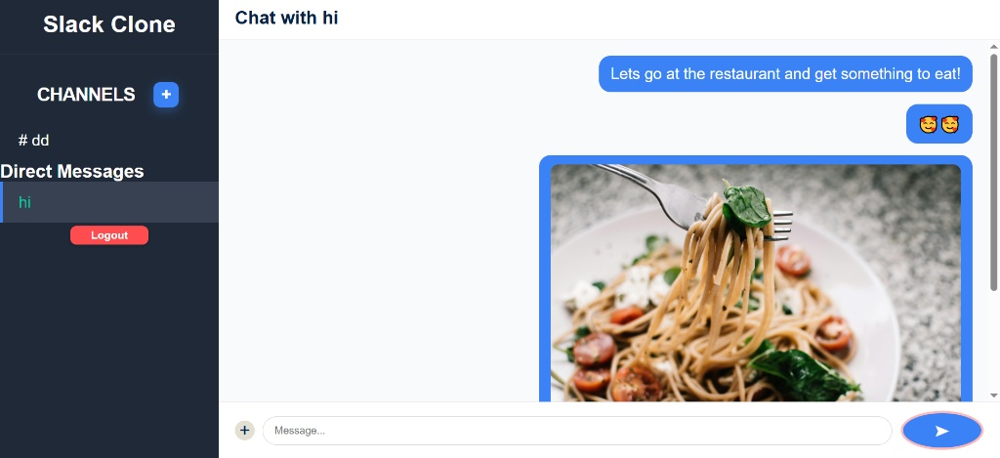

A full-stack real-time chat app (Slack clone) featuring authentication, 
channels, and instant messaging using React, Express and PostgreSQL.



## 🚀 Features

- **Real-Time Messaging:** Instant message delivery and receipt using WebSockets (Socket.io).
- **Channel & Group Management:** Create public/private channels and manage group settings.
- **User Authentication:** Secure registration, login, and session persistence using JWT.
- **Profile & Uploads:** Profile management with support for file/image uploads.
- **Database Architecture:** Robust relational mapping handled via Prisma and PostgreSQL.

---

## ⚙️ Getting Started

### 1. Prerequisites

Ensure you have the following installed on your local machine:
* **Node.js** (v18 or higher recommended)
* **PostgreSQL** database instance


### 1. Clone and Environment Setup

Clone the repository and create your environment configuration files:

```bash

cd backend
cp .env.example .env 


cd frontend
cp .env.example .env 

```